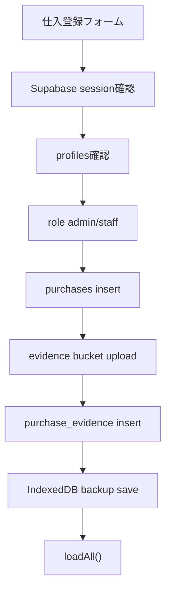

# Supabase Auth ログイン設計書

## 目的

Version1はログイン必須の社内業務システムとして運用する。

未ログイン時のIndexedDB保存は通常運用では使わず、通信障害や移行作業時のバックアップ扱いにする。仕入登録、証憑画像保存、税理士提出パッケージ作成などの業務操作は、Supabase Authでログイン済み、かつ `profiles` に有効な権限があるユーザーだけが実行できるようにする。

## 1. Supabase Authログイン方式

### 採用方式

Version1では、Supabase Authのメールアドレス + パスワードログインを採用する。

理由:

- 社内3〜5人の小規模運用に向いている。
- 管理者がユーザーを事前作成しやすい。
- `profiles` と紐付けて権限管理しやすい。
- Magic Linkよりログイン状態・再ログイン手順が説明しやすい。

### ログイン画面

アプリ起動時にSupabase sessionを確認する。

- sessionなし: ログイン画面を表示し、業務画面は表示しない。
- sessionあり: `profiles` を取得して権限を判定する。
- sessionありだがprofileなし: 利用不可画面を表示する。
- profileが `is_active = false`: 利用停止画面を表示する。

### セッション維持

既存の `src/lib/supabase.ts` は以下の設定を維持する。

- `persistSession: true`
- `autoRefreshToken: true`
- `detectSessionInUrl: true`

ブラウザを閉じても一定期間ログイン状態を維持する。共有PC運用がある場合は、業務終了時のログアウトを運用ルールに含める。

## 2. admin / staff / tax_accountantの画面権限

RLSが最終防御だが、画面上も権限に応じて操作ボタンを制御する。

| 機能 | admin | staff | tax_accountant |
| --- | --- | --- | --- |
| 仕入一覧表示 | 可 | 可 | 可 |
| 集計表示 | 可 | 可 | 可 |
| 証憑画像表示 | 可 | 可 | 可 |
| CSV / Excel / PDF出力 | 可 | 可 | 可 |
| 税理士提出ZIP出力 | 可 | 可 | 可 |
| 仕入新規登録 | 可 | 可 | 不可 |
| 仕入更新 | 可 | 可 | 不可 |
| 仕入削除 | adminのみ | 不可 | 不可 |
| 証憑画像upload | 可 | 可 | 不可 |
| 証憑画像削除 | adminのみ | 不可 | 不可 |
| マスタ管理 | 可 | 不可 | 不可 |
| ユーザー管理 | 可 | 不可 | 不可 |

### 画面制御方針

- `admin`: 全機能を表示する。
- `staff`: 登録・編集・証憑uploadを表示する。管理系は非表示にする。
- `tax_accountant`: 閲覧・出力系だけ表示する。登録フォーム、保存ボタン、画像upload、削除ボタンは非表示またはdisabledにする。
- 未ログイン: ログイン画面のみ表示する。

## 3. 未ログイン時の表示

未ログイン時は業務画面を表示しない。

表示内容:

- メールアドレス入力
- パスワード入力
- ログインボタン
- ログイン失敗メッセージ

表示しないもの:

- 仕入登録フォーム
- 一覧・集計
- CSV / Excel / PDF出力
- 税理士提出ZIP
- 証憑画像操作
- 設定画面

未ログイン時のIndexedDB保存は通常画面からは使わない。既存IndexedDBデータは、ログイン後の移行・バックアップ確認用として扱う。

## 4. ログイン後の保存フロー

### 新規仕入保存



保存条件:

- sessionあり
- `profiles.is_active = true`
- `profiles.role in ('admin', 'staff')`

保存不可:

- 未ログイン
- profileなし
- inactive
- `tax_accountant`

保存不可の場合は、Supabase insertもIndexedDB通常保存も行わず、画面に「ログインまたは権限が必要です」と表示する。

### IndexedDBの扱い

ログイン必須化後もIndexedDB保存処理はすぐ削除しない。

用途:

- 通信障害時の一時退避
- Version1からVersion2への移行確認
- バックアップJSON復元の補助

ただし通常の保存ボタンは、未ログインでは実行不可にする。

## 5. ログアウト

### UI

画面右上または設定メニューに以下を表示する。

- ログイン中ユーザー名
- role
- ログアウトボタン

### ログアウト処理

1. `supabase.auth.signOut()` を実行する。
2. アプリ内のユーザー状態・profile状態をクリアする。
3. 業務画面を非表示にする。
4. ログイン画面へ戻す。

IndexedDBの既存データはログアウト時に削除しない。共有PCでの漏えいが問題になる場合は、将来「ローカルキャッシュ削除」ボタンを追加する。

## 6. profilesとの連携

Authユーザー作成後、必ず `public.profiles` に同じIDの行を作成する。

```text
auth.users.id = profiles.id
```

必要カラム:

| カラム | 用途 |
| --- | --- |
| `id` | Supabase Auth user id |
| `display_name` | 画面表示名 |
| `role` | `admin`, `staff`, `tax_accountant` |
| `is_active` | 利用可否 |

ログイン後に取得する情報:

```sql
select id, display_name, role, is_active
from public.profiles
where id = auth.uid()
```

アプリ側では、このprofileを `currentUser` / `currentProfile` として保持し、画面権限制御に使う。

## 7. RLSとの整合性

現在のRLS方針とログイン必須化は整合している。

### purchases

- select: `admin`, `staff`, `tax_accountant`
- insert: `admin`, `staff`
- update: `admin`, `staff`
- delete: `admin`

### purchase_evidence

- select: `admin`, `staff`, `tax_accountant`
- insert: `admin`, `staff`
- update: `admin`, `staff`
- delete: `admin`

### storage.objects / evidence

- select: `admin`, `staff`, `tax_accountant`
- insert: `admin`, `staff`
- update: `admin`, `staff`
- delete: `admin`

### anon

Version1ではanonに業務データ操作を許可しない。

マスタテーブルのpublic select policyは、接続確認のために一時的に残っている可能性がある。ログイン必須化後は、Phaseの区切りで以下を検討する。

- public master selectを削除する。
- `branches`, `channels`, `categories` も `can_read_app_data()` のみ許可する。

ただし、ログインUI表示前にマスタが不要であれば削除してよい。

## 8. 実装ステップ

### Step 1: Auth state管理

- `authService` を作成する。
- `getSession()`
- `signIn(email, password)`
- `signOut()`
- `getCurrentProfile()`
- `onAuthStateChange()` を扱う。

### Step 2: ログインUI追加

- 未ログイン時はログイン画面のみ表示する。
- ログイン失敗時のエラーを表示する。
- ログイン成功後にprofile取得へ進む。

### Step 3: 権限状態を画面へ反映

- `admin`, `staff`, `tax_accountant` のroleを画面状態に持つ。
- 登録フォーム、保存ボタン、画像upload、削除ボタン、管理系UIをroleごとに制御する。

### Step 4: 保存処理のゲート化

- 保存ボタン押下時にログイン状態とroleを確認する。
- 未ログインなら保存処理全体を止める。
- `tax_accountant` なら保存処理全体を止める。
- `admin/staff` のみ `purchases` insertとStorage uploadを実行する。

### Step 5: ログアウト実装

- `signOut()` 後にログイン画面へ戻す。
- アプリ内profile状態をクリアする。

### Step 6: RLS確認

- adminでinsert/select/updateできること。
- staffでinsert/select/updateできること。
- tax_accountantでselectのみできること。
- anonで業務データ操作できないこと。

### Step 7: public master selectの整理

- ログイン必須化が安定したら、マスタテーブルのpublic select policyを削除するか判断する。

## 推奨実装順

1. `authService` とprofile取得を追加する。
2. 未ログイン時のログイン画面を追加する。
3. ログイン後に業務画面を表示する。
4. role別にボタン・フォームを制御する。
5. 保存処理を `admin/staff` のみに制限する。
6. ログアウトを追加する。
7. RLS実機検証を行う。
8. public master select policyを整理する。

## 懸念点

- 現在は未ログイン時でもIndexedDB保存を継続するコードが残っているため、ログイン必須化時に保存ボタンの入口で止める必要がある。
- 既存IndexedDBデータをどう移行するかは別Phaseで決める必要がある。
- Cloudflare公開URL上でログイン必須にすると、環境変数未設定時は画面が使えなくなるため、環境変数チェック表示が必要。
- `tax_accountant` は画面上では閲覧専用にしても、最終的にはRLSでinsert/update/delete不可にする必要がある。
- public master select policyを残すと、マスタ名だけは未ログインでも読める可能性がある。
