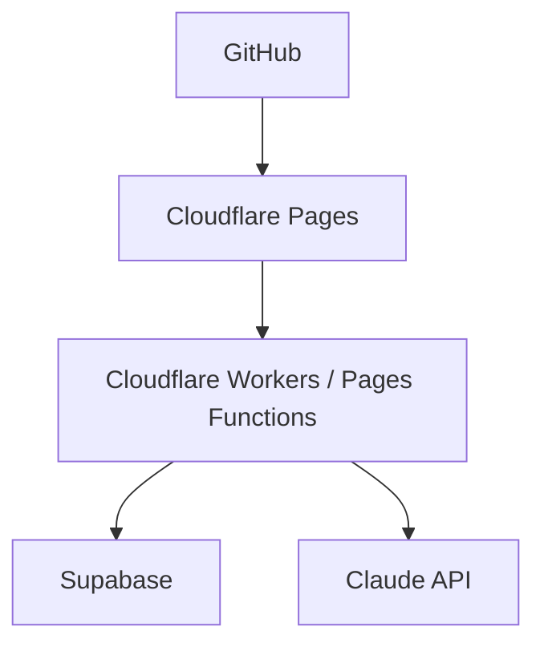
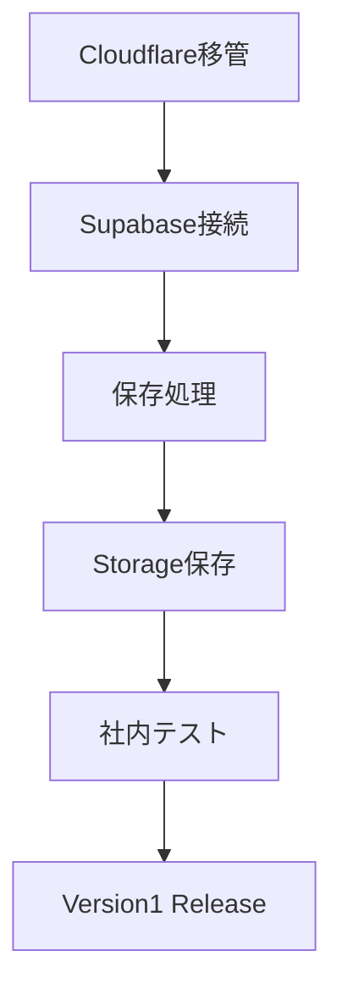

# Cloudflare Workers + Pages 移管設計書

## 目的

Netlifyのクレジット不足により、公開先をCloudflare Workers + Pagesへ移管する。

この設計書では、Version1完成に向けて必要な構成・設定・移植方針・確認手順を整理する。  
この段階ではコード実装、保存処理、Supabase保存処理には進まない。

## アーキテクチャ



役割:

| 構成要素 | 役割 |
| --- | --- |
| GitHub | ソースコード管理、Cloudflare Pagesへの連携元 |
| Cloudflare Pages | Viteでビルドした静的アプリの公開 |
| Cloudflare Workers / Pages Functions | AI抽出など、ブラウザに秘密情報を持たせないサーバー側処理 |
| Supabase | 仕入データ、証憑画像、税理士提出ZIPの保存先 |
| Claude API | 証憑画像のAI抽出 |

## 1. 現在のVite構成

現在のフロントエンドはViteでビルドする構成になっている。

| 項目 | 現在の状態 |
| --- | --- |
| 開発コマンド | `pnpm run dev` |
| 本番ビルド | `pnpm run build` |
| Vite単体ビルド | `pnpm run vite:build` |
| 出力先 | `dist` |
| エントリ | `index.html` |
| TypeScriptエントリ | `src/main.ts` |
| Supabase接続確認 | `src/lib/supabase-connection-check.ts` |
| レガシーJS | `src/classify.js`, `src/csv.js` を `dist/assets/` へコピー |

`package.json` の `build` は、構文チェック・既存テスト・Viteビルドをまとめて実行する。

Cloudflare Pagesでは、Viteの成果物である `dist` を公開ディレクトリとして指定する。

## 2. Cloudflare PagesのBuild command

Cloudflare PagesのBuild commandは以下にする。

```text
pnpm run build
```

理由:

- 現在の `build` スクリプトが構文チェック、テスト、Viteビルドをまとめて実行しているため。
- Viteの標準的な本番出力は `dist` であり、Cloudflare PagesのVite系プリセットとも整合するため。
- デプロイ前に既存テストを通す運用にできるため。

Cloudflare側でpnpmが自動検出されない場合に備え、次工程で必要に応じて `packageManager` の明記、またはCloudflare Pagesのビルドログ確認を行う。

## 3. Cloudflare PagesのOutput directory

Cloudflare PagesのOutput directoryは以下にする。

```text
dist
```

Root directoryはリポジトリ直下のままにする。

```text
/
```

## 4. 必要な環境変数

Cloudflare PagesのProduction環境に以下を設定する。

| 変数名 | 用途 | 公開範囲 | 備考 |
| --- | --- | --- | --- |
| `VITE_SUPABASE_URL` | Supabase接続URL | フロントに埋め込まれる | Supabase Project URL |
| `VITE_SUPABASE_ANON_KEY` | Supabase publishable key | フロントに埋め込まれる | Publishable Keyを標準にする |
| `ANTHROPIC_API_KEY` | Claude AI抽出API | サーバー側のみ | Workers / Pages Functions側で参照 |

`VITE_SUPABASE_ANON_KEY` は名前に `ANON_KEY` が残るが、運用上はSupabaseのPublishable Keyを標準とする。  
Legacy anon keyは、接続エラーなどの切り分け時のみ一時的に使用する。

移植対象Functionsの現行仕様を維持する場合、追加で以下も設定する。

| 変数名 | 用途 | 公開範囲 | 備考 |
| --- | --- | --- | --- |
| `SHARED_SECRET` | AI抽出APIの共有認証 | サーバー側のみ | `X-App-Secret` ヘッダーで照合 |
| `ALLOWED_ORIGIN` | CORS許可Origin | サーバー側のみ | Cloudflare Pagesの本番URL、または独自ドメインを設定 |

注意:

- `VITE_` で始まる環境変数はブラウザ側のビルド成果物に含まれる。
- `ANTHROPIC_API_KEY` は絶対に `VITE_` を付けない。
- APIキー全文をConsoleやログに出さない。

## 5. Functions移植方針

現在のNetlify Functionsは以下の2本。

| 現在のファイル | 役割 | 現在のURL |
| --- | --- | --- |
| `netlify/functions/extract.js` | Anthropic API中継 | `/.netlify/functions/extract` |
| `netlify/functions/sync.js` | Netlify Blobs同期API | `/.netlify/functions/sync` |

Version1ではシンプルに、Cloudflare Pages Functionsとして以下を基本方針にする。

| 移植後ファイル | 移植後URL | 方針 |
| --- | --- | --- |
| `functions/extract.js` | `/extract` | Anthropic API中継を移植する |

### extract.js

`extract.js` はAnthropic APIへの中継が主目的なので、Cloudflare Pages Functionsへ比較的そのまま移植できる。

変更点:

- `exports.handler = async (event) => {}` 形式から、Cloudflare Pages Functionsの `onRequest` 形式へ変更する。
- `process.env.ANTHROPIC_API_KEY` 参照を `context.env.ANTHROPIC_API_KEY` に変更する。
- `event.httpMethod` を `request.method` に置き換える。
- `event.headers` を `request.headers` に置き換える。
- `event.body` のJSONパースを `await request.json()` ベースに変更する。
- CORS、`X-App-Secret` 認証、エラー形式は現行仕様を維持する。

### sync.js

`sync.js` は無理にCloudflareへ移植しない。

理由:

- 現行の `sync.js` は `@netlify/blobs` に依存しており、そのままCloudflare Pagesでは動かない。
- Version2/Phase2でSupabase保存へ寄せる計画がある。
- 中途半端にCloudflare KV/R2へ一時移植すると、保存先が分散して運用が複雑になる。

方針:

- `sync.js` はCloudflare移管時点では移植対象外にする。
- 既存の同期機能は、Phase2のSupabase保存処理に統合する。
- READMEや画面表示でNetlify Blobs同期を案内している箇所は、Cloudflare移管実装時に整理する。

## 6. `netlify.toml` の扱い

Cloudflare Pages移管後、`netlify.toml` はCloudflareのビルドには使われない。

段階的な扱い:

1. 移管設計段階では削除しない。
2. Cloudflare Pagesで本番公開が確認できるまでは残す。
3. Cloudflare移管完了後に削除するか、退避設定として残すかを最終判断する。

Cloudflare Pagesでは、基本設定はダッシュボードで管理できる。  
リポジトリ側に設定を残す場合は、次工程で `wrangler.toml` またはCloudflare Pages用の運用ドキュメントを追加する。

## 7. GitHub連携方法

Cloudflare Pagesで以下の流れで設定する。

1. Cloudflare Dashboardで `Workers & Pages` を開く。
2. `Create application` を選択する。
3. `Pages` から `Connect to Git` を選択する。
4. GitHub連携を許可する。
5. `W-grant/shiire-refund-manager` を選択する。
6. Production branchに `main` を指定する。
7. Build commandに `pnpm run build` を指定する。
8. Output directoryに `dist` を指定する。
9. Environment variablesを設定する。
10. `Save and Deploy` を実行する。

## 8. 移管後の動作確認手順

### デプロイ確認

1. Cloudflare PagesのBuild logで `pnpm run build` が成功していることを確認する。
2. Upload対象が `dist` になっていることを確認する。
3. 公開URLへアクセスし、初期画面が表示されることを確認する。
4. ブラウザConsoleにSupabase接続確認ログが出ることを確認する。

期待ログ:

```text
[Supabase] branches connection check (supabase-js)
[Supabase] branches connection check (fetch)
```

### Supabase接続確認

1. Consoleで `VITE_SUPABASE_URL` と `VITE_SUPABASE_ANON_KEY` が設定済み扱いになっていることを確認する。
2. `branches` テーブルから1件取得できることを確認する。
3. エラーが出る場合は、Cloudflare PagesのProduction環境変数とSupabaseのPublishable Keyを再確認する。
4. Publishable Keyで切り分けできない場合のみ、Legacy anon keyを一時的に使用して比較する。

### AI抽出確認

Cloudflare Functions移植後に実施する。

1. 画面のAI中継URLを `/extract` に変更する。
2. Cloudflare Pages Functions側に `ANTHROPIC_API_KEY` が設定されていることを確認する。
3. 必要に応じて `SHARED_SECRET` と画面側の合言葉を一致させる。
4. 証憑画像を選択し、AI抽出が成功することを確認する。

### 同期機能確認

`sync.js` は移植しないため、Netlify Blobs同期としての確認は実施しない。  
Phase2のSupabase保存処理で、保存・取得・更新・削除の確認に置き換える。

## 9. Version1ロードマップ



優先順位:

1. Cloudflare PagesでViteアプリを公開する。
2. Cloudflare Pages Functionsで `functions/extract.js` を動かす。
3. Supabase接続確認をCloudflare本番環境で通す。
4. 仕入データ保存処理をSupabaseへ接続する。
5. 証憑画像をSupabase Storageへ保存する。
6. 社内3〜5人で運用テストを行う。
7. Version1 Releaseとする。

## 10. 次工程の実装ステップ

1. Cloudflare PagesにGitHub連携プロジェクトを作成する。
2. 環境変数を設定する。
3. まず静的Viteアプリとしてデプロイする。
4. Supabase接続確認ログを確認する。
5. `functions/extract.js` を追加し、AI抽出をCloudflare経由にする。
6. 画面のAI中継URL既定値を `/.netlify/functions/extract` から `/extract` へ変更する。
7. `sync.js` は移植せず、Phase2のSupabase保存へ寄せる。
8. READMEとUSER_GUIDEのNetlify記述をCloudflare Workers + Pages向けに更新する。
9. `netlify.toml` と `@netlify/blobs` の扱いを最終決定する。

## 11. 参考

- Cloudflare Pages Build configuration: https://developers.cloudflare.com/pages/configuration/build-configuration/
- Cloudflare Pages Functions: https://developers.cloudflare.com/pages/functions/
- Cloudflare Pages Git integration: https://developers.cloudflare.com/pages/get-started/git-integration/
