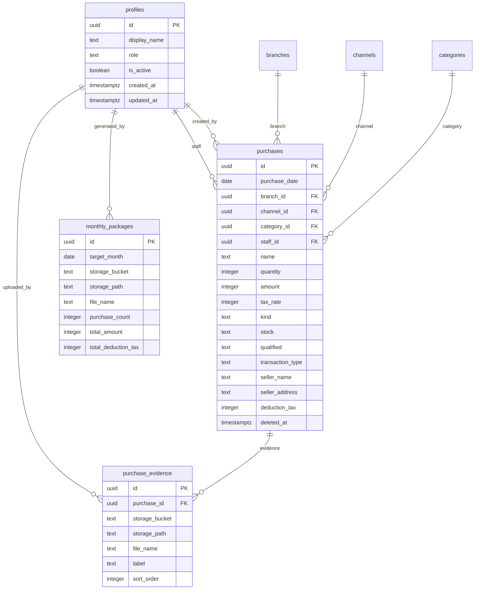

# Version 2 Supabase 設計書

## 目的

Version 2 では、現在ブラウザの IndexedDB に保存している仕入データと証憑画像を Supabase に移行し、社内 3〜5 人で安全に共有できる構成にする。

対象:

- 仕入データ: Supabase Database
- 証憑画像: Supabase Storage
- 月次税理士提出 ZIP: Supabase Storage
- 認証: Supabase Auth
- 権限: 管理者、スタッフ、税理士閲覧用

## 前提

- 社内利用を想定する。
- 利用人数は 3〜5 人程度。
- 仕入入力は管理者・スタッフが行う。
- 税理士は閲覧・ダウンロードのみ行う。
- 既存の IndexedDB / JSON バックアップから移行できるようにする。
- 既存の CSV / Excel / PDF / 証憑 ZIP / 税理士提出 ZIP の出力機能は維持する。

## 権限ロール

| ロール | 想定ユーザー | 主な権限 |
| --- | --- | --- |
| `admin` | 管理者 | 全データの作成、閲覧、更新、削除、設定変更、ユーザー管理 |
| `staff` | 社内スタッフ | 仕入データと証憑の作成、閲覧、更新。原則として削除は制限または論理削除 |
| `tax_accountant` | 税理士閲覧用 | 仕入データ、証憑、月次提出 ZIP の閲覧・ダウンロードのみ |

## テーブル設計

### profiles

Supabase Auth の `auth.users` に紐づくアプリ内プロフィール。

| カラム | 型 | 制約 | 説明 |
| --- | --- | --- | --- |
| `id` | `uuid` | PK, references `auth.users(id)` | ユーザーID |
| `display_name` | `text` | not null | 表示名 |
| `role` | `text` | not null | `admin` / `staff` / `tax_accountant` |
| `is_active` | `boolean` | not null default true | 利用可否 |
| `created_at` | `timestamptz` | not null default now() | 作成日時 |
| `updated_at` | `timestamptz` | not null default now() | 更新日時 |

制約:

- `role in ('admin', 'staff', 'tax_accountant')`

### branches

支店マスタ。

| カラム | 型 | 制約 | 説明 |
| --- | --- | --- | --- |
| `id` | `uuid` | PK default gen_random_uuid() | 支店ID |
| `name` | `text` | not null unique | 支店名 |
| `sort_order` | `integer` | not null default 0 | 表示順 |
| `is_active` | `boolean` | not null default true | 利用可否 |
| `created_at` | `timestamptz` | not null default now() | 作成日時 |
| `updated_at` | `timestamptz` | not null default now() | 更新日時 |

### channels

仕入チャネルマスタ。

| カラム | 型 | 制約 | 説明 |
| --- | --- | --- | --- |
| `id` | `uuid` | PK default gen_random_uuid() | チャネルID |
| `name` | `text` | not null unique | チャネル名 |
| `sort_order` | `integer` | not null default 0 | 表示順 |
| `is_active` | `boolean` | not null default true | 利用可否 |
| `created_at` | `timestamptz` | not null default now() | 作成日時 |
| `updated_at` | `timestamptz` | not null default now() | 更新日時 |

### categories

品目マスタ。

| カラム | 型 | 制約 | 説明 |
| --- | --- | --- | --- |
| `id` | `uuid` | PK default gen_random_uuid() | 品目ID |
| `name` | `text` | not null unique | 品目名 |
| `sort_order` | `integer` | not null default 0 | 表示順 |
| `is_active` | `boolean` | not null default true | 利用可否 |
| `created_at` | `timestamptz` | not null default now() | 作成日時 |
| `updated_at` | `timestamptz` | not null default now() | 更新日時 |

### purchases

仕入明細本体。

| カラム | 型 | 制約 | 説明 |
| --- | --- | --- | --- |
| `id` | `uuid` | PK default gen_random_uuid() | 仕入ID |
| `purchase_date` | `date` | not null | 仕入日 |
| `branch_id` | `uuid` | references `branches(id)` | 支店 |
| `channel_id` | `uuid` | references `channels(id)` | チャネル |
| `category_id` | `uuid` | references `categories(id)` | 品目 |
| `staff_id` | `uuid` | references `profiles(id)` | 担当者 |
| `name` | `text` | not null | 商品名 |
| `quantity` | `integer` | not null default 1 | 数量 |
| `amount` | `integer` | not null | 金額税込 |
| `tax_rate` | `integer` | not null default 10 | 税率 |
| `kind` | `text` | not null | `kobutsu` / `jun` / `other` |
| `stock` | `text` | not null | `yes` / `no` |
| `qualified` | `text` | not null | `yes` / `no` / `unknown` |
| `transaction_type` | `text` | not null | `anon` / `named` |
| `seller_name` | `text` | | 相手方氏名 |
| `seller_address` | `text` | | 相手方住所 |
| `memo` | `text` | | メモ |
| `deduction_kind` | `text` | | 保存時点の控除区分 |
| `deduction_ratio` | `numeric(5,2)` | | 保存時点の控除割合 |
| `deduction_tax` | `integer` | | 保存時点の控除対象仕入税額 |
| `classification_note` | `text` | | 判定メモ |
| `created_by` | `uuid` | references `profiles(id)` | 作成者 |
| `updated_by` | `uuid` | references `profiles(id)` | 更新者 |
| `deleted_at` | `timestamptz` | | 論理削除日時 |
| `created_at` | `timestamptz` | not null default now() | 作成日時 |
| `updated_at` | `timestamptz` | not null default now() | 更新日時 |

制約:

- `amount >= 0`
- `quantity >= 1`
- `tax_rate in (8, 10)`
- `kind in ('kobutsu', 'jun', 'other')`
- `stock in ('yes', 'no')`
- `qualified in ('yes', 'no', 'unknown')`
- `transaction_type in ('anon', 'named')`

補足:

- 控除区分・控除税額はフロントエンド計算を継続しつつ、提出時点の再現性を高めるため保存する。
- 将来、DB関数で再計算する場合も `purchases` の元データを正とする。

### purchase_evidence

1件の仕入に複数の証憑画像を紐づける。

| カラム | 型 | 制約 | 説明 |
| --- | --- | --- | --- |
| `id` | `uuid` | PK default gen_random_uuid() | 証憑ID |
| `purchase_id` | `uuid` | not null references `purchases(id)` on delete cascade | 仕入ID |
| `storage_bucket` | `text` | not null default `evidence` | Storage bucket |
| `storage_path` | `text` | not null unique | Storage path |
| `file_name` | `text` | not null | 元ファイル名 |
| `label` | `text` | | 明細、商品ページ、現物写真など |
| `mime_type` | `text` | not null | MIME type |
| `file_size` | `bigint` | | ファイルサイズ |
| `sort_order` | `integer` | not null default 0 | 表示順 |
| `uploaded_by` | `uuid` | references `profiles(id)` | アップロード者 |
| `created_at` | `timestamptz` | not null default now() | 作成日時 |

### monthly_packages

税理士提出パッケージZIPの履歴。

| カラム | 型 | 制約 | 説明 |
| --- | --- | --- | --- |
| `id` | `uuid` | PK default gen_random_uuid() | パッケージID |
| `target_month` | `date` | not null | 対象月。月初日で保存 |
| `storage_bucket` | `text` | not null default `tax-packages` | Storage bucket |
| `storage_path` | `text` | not null unique | ZIPのStorage path |
| `file_name` | `text` | not null | ZIPファイル名 |
| `purchase_count` | `integer` | not null default 0 | 明細件数 |
| `total_amount` | `integer` | not null default 0 | 仕入総額 |
| `total_deduction_tax` | `integer` | not null default 0 | 控除対象仕入税額 |
| `generated_by` | `uuid` | references `profiles(id)` | 作成者 |
| `generated_at` | `timestamptz` | not null default now() | 作成日時 |

制約:

- `unique(target_month, storage_path)`

### audit_logs

重要操作の監査ログ。

| カラム | 型 | 制約 | 説明 |
| --- | --- | --- | --- |
| `id` | `bigint` | PK generated always as identity | ログID |
| `actor_id` | `uuid` | references `profiles(id)` | 操作者 |
| `action` | `text` | not null | 操作種別 |
| `target_table` | `text` | | 対象テーブル |
| `target_id` | `uuid` | | 対象ID |
| `metadata` | `jsonb` | not null default `{}` | 補足情報 |
| `created_at` | `timestamptz` | not null default now() | 作成日時 |

## ER図



## Storage構成

### Buckets

| Bucket | 用途 | Public | 備考 |
| --- | --- | --- | --- |
| `evidence` | 証憑画像 | false | signed URL で表示・ダウンロード |
| `tax-packages` | 月次税理士提出ZIP | false | 税理士閲覧用にもダウンロード許可 |
| `imports` | 移行用一時ファイル | false | 必要な場合のみ。移行後削除 |

### evidence bucket

推奨パス:

```text
evidence/
  purchases/
    YYYY/
      MM/
        {purchase_id}/
          001_{label}_{original_file_name}
          002_{label}_{original_file_name}
```

例:

```text
purchases/2026/06/8f3.../001_明細_receipt.jpg
purchases/2026/06/8f3.../002_商品ページ_item-page.jpg
purchases/2026/06/8f3.../003_現物写真_photo.jpg
```

### tax-packages bucket

推奨パス:

```text
tax-packages/
  YYYY/
    MM/
      税理士提出_YYYY-MM_{generated_at}.zip
```

例:

```text
2026/06/税理士提出_2026-06_20260701T102030.zip
```

## RLS権限設計

### 基本方針

- 全テーブルで RLS を有効化する。
- ユーザーロールは `profiles.role` を参照する。
- `admin` は全操作可能。
- `staff` は仕入と証憑の作成・閲覧・更新が可能。
- `tax_accountant` は閲覧のみ可能。
- 削除は物理削除ではなく `deleted_at` による論理削除を基本にする。

### 共通ヘルパー関数

想定するSQL関数:

```sql
create or replace function public.current_role()
returns text
language sql
security definer
stable
as $$
  select role
  from public.profiles
  where id = auth.uid()
    and is_active = true
$$;
```

### profiles

| 操作 | admin | staff | tax_accountant |
| --- | --- | --- | --- |
| select | 全件 | 自分のみ | 自分のみ |
| insert | 可 | 不可 | 不可 |
| update | 可 | 自分の表示名のみ | 自分の表示名のみ |
| delete | 不可 | 不可 | 不可 |

### master tables

対象: `branches`, `channels`, `categories`

| 操作 | admin | staff | tax_accountant |
| --- | --- | --- | --- |
| select | 可 | 可 | 可 |
| insert | 可 | 不可 | 不可 |
| update | 可 | 不可 | 不可 |
| delete | 可 | 不可 | 不可 |

### purchases

| 操作 | admin | staff | tax_accountant |
| --- | --- | --- | --- |
| select | deleted含む全件 | deleted以外 | deleted以外 |
| insert | 可 | 可 | 不可 |
| update | 可 | deleted以外のみ可 | 不可 |
| delete | 原則不可 | 不可 | 不可 |

補足:

- 削除操作はアプリ側で `deleted_at` を設定する。
- `staff` の過去月編集を制限する場合、後続で月次締めテーブルを追加する。

### purchase_evidence

| 操作 | admin | staff | tax_accountant |
| --- | --- | --- | --- |
| select | 可 | 可 | 可 |
| insert | 可 | 可 | 不可 |
| update | 可 | 可 | 不可 |
| delete | 可 | 不可または論理削除相当 | 不可 |

### monthly_packages

| 操作 | admin | staff | tax_accountant |
| --- | --- | --- | --- |
| select | 可 | 可 | 可 |
| insert | 可 | 可 | 不可 |
| update | 可 | 不可 | 不可 |
| delete | 可 | 不可 | 不可 |

### Storage RLS

`storage.objects` に対して次の方針を適用する。

#### evidence bucket

- select:
  - `admin`, `staff`, `tax_accountant`
- insert:
  - `admin`, `staff`
- update:
  - `admin`, `staff`
- delete:
  - `admin`

#### tax-packages bucket

- select:
  - `admin`, `staff`, `tax_accountant`
- insert:
  - `admin`, `staff`
- update:
  - `admin`
- delete:
  - `admin`

## 認証方式

### 推奨

Supabase Auth のメールログインを使う。

候補:

1. メール + パスワード
2. Magic Link

社内 3〜5 人であれば、初期はメール + パスワードが運用しやすい。

### ユーザー作成フロー

1. 管理者が Supabase Auth にユーザーを招待または作成する。
2. `profiles` に `id`, `display_name`, `role` を登録する。
3. 初回ログイン後、アプリが `profiles` を読み込み、権限に応じてUIを切り替える。

### UI制御

- `admin`
  - 全メニュー表示
  - マスタ編集、削除、ユーザー管理を表示
- `staff`
  - 仕入登録、証憑登録、出力を表示
  - ユーザー管理は非表示
- `tax_accountant`
  - 登録・編集・削除ボタンを非表示
  - 一覧、証憑、提出ZIPダウンロードのみ表示

RLSが最終防衛線であり、UI非表示だけに依存しない。

## バックアップ方針

### Database

- Supabase の自動バックアップを利用する。
- Proプラン以上の場合は Point-in-Time Recovery の利用を検討する。
- 追加で月1回、提出ZIP作成後にCSV / JSONエクスポートを保管する。

### Storage

- `evidence` と `tax-packages` は private bucket とする。
- 月次提出ZIPは、税理士提出後も削除せず履歴として保管する。
- 誤削除対策として、アプリからの物理削除は管理者のみ許可する。

### アプリ側バックアップ

Version 1 の JSONバックアップ機能は当面残す。

用途:

- 移行前バックアップ
- 障害時の簡易復元
- 税理士提出済み月の控え

## 既存データ移行方針

### 移行元

対象:

- IndexedDB の `records`
- IndexedDB の `images`
- JSONバックアップ内の `records`
- JSONバックアップ内の `images`
- JSONバックアップ内の `meta`

### 推奨移行手順

1. Version 1 で `バックアップ` を出力する。
2. Version 2 の管理者画面で `V1バックアップJSONをインポート` を選ぶ。
3. JSON内の `meta` を `branches`, `channels`, `categories` に upsert する。
4. JSON内の `records` を `purchases` に insert する。
5. JSON内の `images` を `purchase_evidence` と Supabase Storage に移行する。
6. 移行結果として、件数、証憑枚数、失敗行を表示する。
7. 移行後に月次パッケージを試しに作成し、税理士提出形式を確認する。

### 既存1枚証憑との互換

Version 1 には次の2形式があり得る。

旧形式:

```json
{
  "id": "purchase-id",
  "full": "data:image/jpeg;base64,...",
  "thumb": "data:image/jpeg;base64,...",
  "fileName": "receipt.jpg"
}
```

複数証憑形式:

```json
{
  "id": "purchase-id",
  "images": [
    {
      "full": "data:image/jpeg;base64,...",
      "thumb": "data:image/jpeg;base64,...",
      "fileName": "receipt.jpg"
    }
  ]
}
```

移行処理では両方を受け付け、`purchase_evidence` に複数行として保存する。

### ID方針

- 既存 `record.id` がUUIDの場合は `purchases.id` として引き継ぐ。
- UUIDでない場合は新規UUIDを発行し、移行マップを保持する。
- 証憑Storage pathには `purchase_id` を含める。

### 金額・判定方針

- `amount`, `tax_rate`, `kind`, `stock`, `qualified`, `transaction_type` は移行元を正とする。
- `deduction_kind`, `deduction_ratio`, `deduction_tax` は移行時に再計算して保存する。
- 再計算結果が移行元CSV等と違う場合は、移行レポートに警告を出す。

## 実装ステップ

### Step 1: Supabaseプロジェクト準備

- Supabaseプロジェクトを作成する。
- Authのログイン方式を決める。
- private Storage bucket を作成する。
- 環境変数を用意する。

必要な環境変数:

- `SUPABASE_URL`
- `SUPABASE_ANON_KEY`
- 必要に応じて管理作業用の `SUPABASE_SERVICE_ROLE_KEY`

### Step 2: DBマイグレーション作成

- `profiles`
- `branches`
- `channels`
- `categories`
- `purchases`
- `purchase_evidence`
- `monthly_packages`
- `audit_logs`
- updated_at trigger
- RLS policy
- Storage policy

### Step 3: 認証UI

- ログイン画面を追加する。
- ログアウトを追加する。
- `profiles` を読み込み、ロール別UI制御を追加する。

### Step 4: 仕入CRUDのSupabase化

- IndexedDB 読み書きを Supabase Database に置き換える。
- 一覧、検索、月別フィルタを Supabase 取得に対応する。
- オフライン前提は外す。必要なら後続でローカルキャッシュを検討する。

### Step 5: 証憑Storage化

- 画像アップロードを Supabase Storage に変更する。
- `purchase_evidence` にメタデータを保存する。
- signed URL で証憑を表示する。
- 複数証憑の表示・削除・並び替えを維持する。

### Step 6: 月次提出ZIPのStorage保存

- 既存の月次ZIP生成処理を利用する。
- 生成したZIPを `tax-packages` bucket に保存する。
- `monthly_packages` に履歴を保存する。
- 税理士閲覧用ユーザーがダウンロードできるようにする。

### Step 7: V1データ移行

- JSONバックアップインポート画面を追加する。
- records / images / meta を移行する。
- 移行前プレビュー、移行結果、エラーレポートを表示する。

### Step 8: 権限・監査ログ

- RLSを有効化する。
- UIだけでなくDB側で権限を検証する。
- 作成、更新、削除、提出ZIP作成を `audit_logs` に記録する。

### Step 9: テスト

- RLSポリシーのSQLテスト
- ロール別画面表示テスト
- 仕入CRUDテスト
- 証憑アップロード・表示テスト
- V1バックアップ移行テスト
- 月次提出ZIP生成テスト

## 未決事項

- 税理士ユーザーに全期間閲覧を許可するか、月次提出済みデータだけ閲覧可能にするか。
- スタッフの削除権限を完全禁止にするか、論理削除のみ許可するか。
- 月次締め機能を Version 2 初期に入れるか、後続にするか。
- Excel/PDF生成をブラウザ側で継続するか、Edge Functionでサーバー生成するか。
