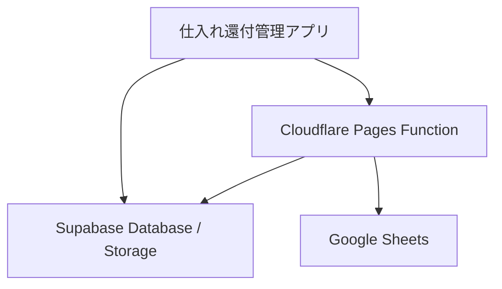
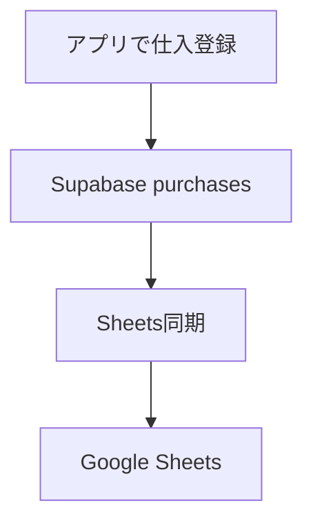
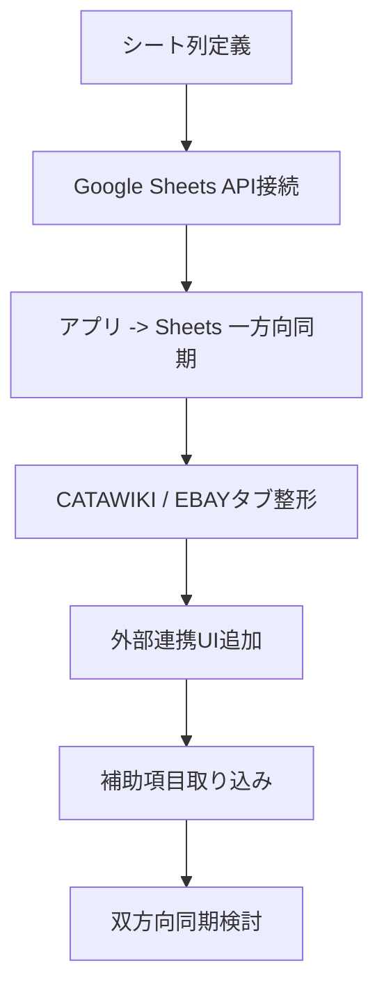

# Google Sheets 連携設計書

## 目的

仕入れ還付管理アプリの仕入データを、Google Sheetsにも反映できるようにする。

主な利用先は以下。

- CATAWIKI
- EBAY
- 将来的なその他販売サイト、仕入管理シート

この設計では、Supabaseを正本データベースとして維持し、Google Sheetsは業務確認、共有、補助編集、分析用のビューとして使う。

対象スプレッドシート:

```text
https://docs.google.com/spreadsheets/d/1gdy_s-lcdn-CxJJimlvTtOw8P8PH_PQPBdv2gC-GVcQ/edit
```

Spreadsheet ID:

```text
1gdy_s-lcdn-CxJJimlvTtOw8P8PH_PQPBdv2gC-GVcQ
```

## 結論

連結は可能。

ただし、Version1直後は双方向同期ではなく、まずは以下の順で進めるのが安全。

1. Supabaseの仕入データをGoogle Sheetsへ自動反映
2. CATAWIKI / EBAY別のシートへ整形出力
3. Google Sheets側で管理したい補助項目を定義
4. 必要な補助項目だけアプリへ取り込み
5. 双方向同期は最後に検討

## 基本方針

### 正本

| データ | 正本 |
| --- | --- |
| 仕入本体 | Supabase `purchases` |
| 証憑画像 | Supabase Storage `evidence` |
| 証憑メタ情報 | Supabase `purchase_evidence` |
| 税理士提出ZIP | Supabase Storage `tax-packages` |
| Google Sheets | 共有・確認・補助管理用 |

Google Sheetsを正本にしない理由:

- 証憑画像を安全に管理しにくい
- RLSのような権限管理が弱い
- 同時編集時の競合管理が難しい
- 削除、更新、税務提出データとの整合が崩れやすい

## 連携方式

### 推奨方式: Cloudflare Functions + Google Sheets API

Cloudflare Pages FunctionsからGoogle Sheets APIを呼び出す。



特徴:

- APIキーやサービスアカウント秘密鍵をブラウザへ出さない
- Supabaseの権限と整合しやすい
- 手動同期、自動同期、月次同期を後から追加しやすい

### 代替方式: Google Apps Script Web App

Google Sheets側にApps Scriptを置き、Cloudflare Functionから呼び出す方式。

メリット:

- Sheets操作は簡単
- シート側で加工しやすい

デメリット:

- 認証、秘密情報、実行ログが分散する
- アプリ側からの制御がやや複雑
- 将来的な保守性はCloudflare Functions方式より低い

## 認証方式

### Google Sheets API方式

Google Cloudでサービスアカウントを作成し、対象スプレッドシートをサービスアカウントのメールアドレスへ共有する。

必要な権限:

- Google Sheets API有効化
- Service Account作成
- 対象スプレッドシートへ編集権限で共有

Cloudflare環境変数:

| 変数名 | 内容 |
| --- | --- |
| `GOOGLE_SHEETS_CLIENT_EMAIL` | サービスアカウントのメール |
| `GOOGLE_SHEETS_PRIVATE_KEY` | サービスアカウント秘密鍵 |
| `GOOGLE_SHEETS_SPREADSHEET_ID` | 対象スプレッドシートID |
| `GOOGLE_SHEETS_SYNC_SECRET` | 手動同期API保護用の内部シークレット |

既存環境変数:

| 変数名 | 内容 |
| --- | --- |
| `VITE_SUPABASE_URL` | Supabase URL |
| `VITE_SUPABASE_ANON_KEY` | Supabase publishable key |
| `ANTHROPIC_API_KEY` | AI抽出用 |

## シート構成案

対象スプレッドシート内に、以下のタブを作る。

### 01_仕入一覧

アプリの仕入一覧とほぼ同じ内容。

| 列 | 内容 | 方向 |
| --- | --- | --- |
| `purchase_id` | Supabase `purchases.id` | app -> sheet |
| `仕入日` | 仕入日 | app -> sheet |
| `利用先` | CATAWIKI / EBAY / その他 | app -> sheet |
| `チャネル` | 仕入チャネル | app -> sheet |
| `商品名` | 商品名 | app -> sheet |
| `品目` | カテゴリ | app -> sheet |
| `数量` | 数量 | app -> sheet |
| `金額税込` | 仕入金額 | app -> sheet |
| `税率` | 税率 | app -> sheet |
| `相手方` | 相手方氏名 | app -> sheet |
| `住所` | 相手方住所 | app -> sheet |
| `控除区分` | 古物商特例・経過措置など | app -> sheet |
| `控除税額` | 控除対象税額 | app -> sheet |
| `証憑枚数` | 紐づく画像数 | app -> sheet |
| `証憑URL` | 代表画像またはアプリ詳細リンク | app -> sheet |
| `メモ` | メモ | app -> sheet |
| `更新日時` | Supabase `updated_at` | app -> sheet |

### 02_CATAWIKI

CATAWIKI用の管理ビュー。

| 列 | 内容 | 方向 |
| --- | --- | --- |
| `purchase_id` | 仕入ID | app -> sheet |
| `商品名` | 仕入商品名 | app -> sheet |
| `仕入額` | 税込金額 | app -> sheet |
| `出品予定` | チェック・ステータス | sheet -> app候補 |
| `CATAWIKI管理番号` | 出品側管理番号 | sheet -> app候補 |
| `出品日` | 出品日 | sheet -> app候補 |
| `販売予定価格` | 価格管理 | sheet -> app候補 |
| `備考` | 運用メモ | sheet -> app候補 |

### 03_EBAY

EBAY用の管理ビュー。

| 列 | 内容 | 方向 |
| --- | --- | --- |
| `purchase_id` | 仕入ID | app -> sheet |
| `商品名` | 仕入商品名 | app -> sheet |
| `仕入額` | 税込金額 | app -> sheet |
| `eBay SKU` | SKU | sheet -> app候補 |
| `出品ステータス` | 未出品 / 出品中 / 売却済など | sheet -> app候補 |
| `出品日` | 出品日 | sheet -> app候補 |
| `販売価格` | USD/JPYなど | sheet -> app候補 |
| `備考` | 運用メモ | sheet -> app候補 |

### 04_差分ログ

同期結果を記録する。

| 列 | 内容 |
| --- | --- |
| `synced_at` | 同期日時 |
| `direction` | app_to_sheet / sheet_to_app |
| `target` | purchases / catawiki / ebay |
| `count` | 件数 |
| `result` | success / failed |
| `message` | エラー詳細 |

### 99_設定

運用設定。

| キー | 値 |
| --- | --- |
| `version` | シート定義バージョン |
| `last_app_to_sheet_sync` | 最終反映日時 |
| `last_sheet_to_app_sync` | 最終取込日時 |

## データ方向

### Phase1: アプリからSheetsへ反映

最初は一方向同期にする。



対象:

- 仕入一覧
- CATAWIKI用ビュー
- EBAY用ビュー
- 証憑枚数
- 代表証憑URL

### Phase2: Sheets側の補助項目を取り込み

Sheets側で管理したい項目だけをアプリへ戻す。

例:

- CATAWIKI管理番号
- EBAY SKU
- 出品ステータス
- 出品日
- 販売予定価格
- 備考

この段階でSupabaseに追加テーブルを作る。

## 追加テーブル案

仕入本体 `purchases` に直接すべて追加すると肥大化するため、販売先別の補助テーブルを追加する。

### purchase_sales_links

```sql
create table public.purchase_sales_links (
  id uuid primary key default gen_random_uuid(),
  purchase_id uuid not null references public.purchases(id) on delete cascade,
  destination text not null check (destination in ('catawiki', 'ebay', 'other')),
  external_id text,
  sku text,
  listing_status text,
  listing_date date,
  expected_sale_price integer,
  currency text default 'JPY',
  memo text,
  created_at timestamptz not null default now(),
  updated_at timestamptz not null default now(),
  unique (purchase_id, destination)
);
```

用途:

- CATAWIKI管理番号
- EBAY SKU
- 出品状況
- 販売予定価格
- 販売先別メモ

## 同期方式

### 手動同期

画面に「Google Sheetsへ反映」ボタンを追加する。

対象:

- admin
- staff

流れ:

1. ボタン押下
2. Cloudflare Function `/api/google-sheets/sync` を呼ぶ
3. FunctionがSupabaseから仕入データを取得
4. Sheets APIで対象タブを更新
5. 結果を画面に表示

### 自動同期

将来的に以下を検討する。

- 仕入登録成功後に自動反映
- 1日1回の定期同期
- 月次税理士提出ZIP作成時に同時反映

Version1直後は手動同期から開始する。

## 更新方法

### 全件上書き方式

Phase1は全件上書きでよい。

メリット:

- 実装が単純
- 差分漏れが起きにくい
- シート側の古い行が残りにくい

注意:

- Sheets側でアプリ反映列を手編集しても上書きされる
- 補助入力列は別タブ、または保護列に分ける

### 差分更新方式

Phase2以降で検討する。

条件:

- `purchase_id` をキーに行を特定
- `updated_at` で差分判定
- 削除済みはシートからも除外、またはステータス更新

## 証憑画像の扱い

Sheetsに画像本体は保存しない。

表示する候補:

1. 証憑枚数
2. 代表画像の署名付きURL
3. アプリ内の詳細画面URL
4. Storage path

推奨:

- Phase1: 証憑枚数のみ
- Phase2: アプリ詳細リンク
- Phase3: 期限付き署名URL

理由:

- 証憑画像は税務・個人情報を含む可能性がある
- Google Sheets上に直接画像URLを長期公開しない方が安全

## 権限

### アプリ側

| role | Sheets反映 | Sheets取込 |
| --- | --- | --- |
| admin | 可 | 可 |
| staff | 可 | 原則不可、必要なら可 |
| tax_accountant | 不可 | 不可 |

### Google Sheets側

シート編集権限は最小限にする。

推奨:

- 管理者: 編集可
- スタッフ: 必要タブのみ編集可
- 税理士: 閲覧のみ

## 競合ルール

Phase1:

- アプリのデータを優先
- Sheetsのアプリ反映列は上書き
- Sheets側の補助列は別タブで保持

Phase2:

- `purchase_id + destination` をキーに取り込み
- アプリ側で更新日時を持つ
- 競合時は画面に確認リストを出す

## UI案

CSV入出力パネル、または新しい「外部連携」パネルに以下を追加する。

### 外部連携

- Google Sheetsへ反映
- 最終同期日時
- 同期対象
  - 仕入一覧
  - CATAWIKI
  - EBAY
- 同期結果

初期表示は折りたたみでもよい。

## Cloudflare Functions案

### `/api/google-sheets/health`

目的:

- 環境変数が設定されているか確認
- Sheets APIへ接続できるか確認

返却例:

```json
{
  "ok": true,
  "configured": true,
  "spreadsheetId": "1gdy_s-lcdn-CxJJimlvTtOw8P8PH_PQPBdv2gC-GVcQ"
}
```

### `/api/google-sheets/sync`

目的:

- Supabaseから仕入データを取得
- Google Sheetsへ反映

入力:

```json
{
  "targets": ["purchases", "catawiki", "ebay"]
}
```

返却例:

```json
{
  "ok": true,
  "updated": {
    "purchases": 120,
    "catawiki": 80,
    "ebay": 40
  }
}
```

## 実装ステップ

### Step1: シート定義確定

- 既存Google Sheetsのタブ構成を確認
- 必要列を決める
- `purchase_id` 列を必ず入れる
- アプリ反映列と手入力列を分ける

### Step2: Google Cloud設定

- Google Sheets API有効化
- サービスアカウント作成
- 対象シートをサービスアカウントへ共有
- Cloudflare環境変数を設定

### Step3: Function実装

- `/api/google-sheets/health`
- `/api/google-sheets/sync`
- Google Sheets API認証
- シート上書き処理

### Step4: アプリUI追加

- 外部連携パネル追加
- Google Sheetsへ反映ボタン
- 最終同期結果表示

### Step5: CATAWIKI / EBAYタブ対応

- CATAWIKI用行生成
- EBAY用行生成
- 必要なら販売先区分を追加

### Step6: 補助項目取り込み

- `purchase_sales_links` テーブル追加
- Sheetsから補助列を取り込み
- アプリ詳細表示へ反映

## 最初に決めるべきこと

1. CATAWIKIとEBAYを同じ仕入から両方に使う可能性があるか
2. 1件の仕入を分割して複数販売先に回す可能性があるか
3. Sheets側で管理したい項目は何か
4. Sheets側で手編集した内容をアプリへ戻す必要があるか
5. 証憑画像のURLをSheetsに出してよいか

## 推奨ロードマップ



## 推奨する最初の実装

最初は以下だけに絞る。

- Supabaseから仕入一覧を取得
- Google Sheetsの `01_仕入一覧` を全件上書き
- CATAWIKI / EBAYはチャネルまたは利用先で振り分け
- 証憑画像は枚数のみ出力
- 手動同期ボタンのみ

この範囲なら、現在の仕入管理機能を壊さずにGoogle Sheets連携を追加できる。

## 確定方針: CATAWIKI / EBAY向け追加項目

Google Sheets連携に先立ち、アプリ側の仕入データに以下の項目を追加する。

| 項目 | 用途 | 初期値 |
| --- | --- | --- |
| `manufacturer` | メーカー名 | 空欄 |
| `item_price` | 商品本体価格 | 既存の仕入総額 |
| `shipping_fee_total` | 送料・手数料合計 | `0` |
| `destination` | 利用先 | `undecided` |

### 金額の定義

既存の `amount` は引き続き仕入総額として扱う。

```text
仕入総額税込 = 商品本体価格 + 送料・手数料合計
```

税務計算、控除税額、古物商特例判定は、これまで通り仕入総額税込 `amount` を対象にする。

Google Sheetsでは以下の列へ出力する。

| Sheets列 | 内容 | アプリ項目 |
| --- | --- | --- |
| F列 | 商品名 | `name` |
| G列 | メーカー名 | `manufacturer` |
| J列 | 仕入れ日 | `date` / `purchase_date` |
| K列 | 仕入れ価格 | `item_price` |
| L列 | 送料、手数料合計 | `shipping_fee_total` |

### 利用先

仕入登録に `利用先` を追加する。

候補:

- CATAWIKI
- EBAY
- 共通
- 未定
- その他

内部値:

| 表示 | 内部値 |
| --- | --- |
| CATAWIKI | `catawiki` |
| EBAY | `ebay` |
| 共通 | `both` |
| 未定 | `undecided` |
| その他 | `other` |

`destination` はGoogle SheetsのCATAWIKIタブ、EBAYタブへの振り分けに使う。

### 既存データの移行

既存データは壊さず、以下の初期値で扱う。

| 既存データ | 新項目の初期値 |
| --- | --- |
| `manufacturer` | 空欄 |
| `item_price` | 既存の `amount` |
| `shipping_fee_total` | `0` |
| `destination` | `undecided` |

この移行により、既存の控除判定、CSV、Excel、PDF、税理士提出ZIPの金額計算を維持する。

### AI抽出方針

AI抽出では以下を追加で抽出する。

- メーカー名
- 商品本体価格
- 送料
- 手数料
- 送料・手数料合計
- 利用先候補

保存項目としては、まず以下に絞る。

- `manufacturer`
- `item_price`
- `shipping_fee_total`
- `destination`

送料と手数料を個別保持するかは、次の段階で判断する。Version1.1では合計値だけでよい。

### Supabase追加カラム案

`public.purchases` に以下を追加する。

```sql
alter table public.purchases
  add column if not exists manufacturer text,
  add column if not exists item_price integer,
  add column if not exists shipping_fee_total integer not null default 0,
  add column if not exists destination text not null default 'undecided'
    check (destination in ('catawiki', 'ebay', 'both', 'undecided', 'other'));
```

既存行の初期補正:

```sql
update public.purchases
set item_price = amount
where item_price is null;
```

### 実装順

1. Supabase schemaに追加カラムを定義
2. Mapper / Repository / Serviceに新項目を追加
3. 仕入登録フォームに `メーカー名`, `商品本体価格`, `送料・手数料合計`, `利用先` を追加
4. `amount` を `item_price + shipping_fee_total` で更新するUIにする
5. AI抽出結果に新項目を追加
6. CSV / Excel / PDF / 税理士提出ZIPの既存出力が壊れていないことを確認
7. Google Sheets同期でF/G/J/K/Lへ出力

### 注意点

- `amount` は税務計算のため残す。
- `item_price` と `shipping_fee_total` の合計が `amount` とずれた場合は、保存前に画面で補正または警告する。
- メーカー名はAI推定だけにせず、必ず手修正できるようにする。
- CATAWIKI / EBAYの補助管理項目は `purchase_sales_links` へ分離し、仕入本体を肥大化させない。
