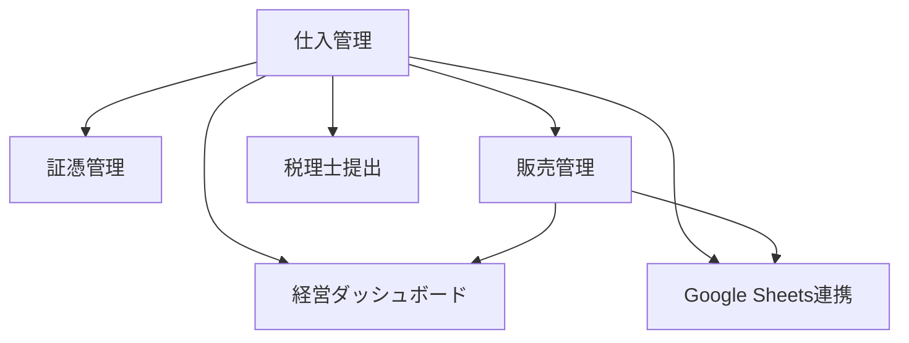

# 販売管理・経営ダッシュボード設計書

## 目的

仕入れ還付管理アプリに、販売管理と経営ダッシュボードを追加する。

現在のアプリは仕入、証憑、税務提出を中心に管理している。次の段階では、CATAWIKI / EBAYでの販売状況、売上、粗利益、利益率、担当者別成績を一目で確認できる状態にする。

この機能は別プロジェクトではなく、同じアプリ内の別画面として追加する。

## 基本方針



### 正本データ

| データ | 正本 |
| --- | --- |
| 仕入情報 | Supabase `purchases` |
| 証憑画像 | Supabase Storage `evidence` |
| 販売情報 | Supabase `sales` |
| 販売手数料・送料 | Supabase `sale_costs` または `sales` 内集約 |
| ダッシュボード | Supabaseの仕入・販売データから算出 |
| Google Sheets | 共有、補助入力、確認用 |

Google Sheetsは見やすさ、権限、画像、税務整合性の面で正本にはしない。  
アプリ側を意思決定画面、Sheetsを補助ビューとして使う。

## デザイン方針

方向性は **Shopify Admin + Stripe Dashboard寄り** にする。

### トーン

- 派手すぎない
- 数字が読みやすい
- 経営判断向け
- 高級感は少しあるが、業務画面として落ち着いている
- 余白はあるが、情報密度も確保する
- PCでの一覧性を重視し、スマホでは確認中心

### UI原則

- KPIは上部にカードで表示
- グラフは売上・粗利益・販売先別を中心にする
- テーブルは実務確認用として下部に置く
- 未処理や赤字など、注意すべきものはアラートとして出す
- 丸みは控えめ、カード角丸は8px以下
- 色は単色に寄せすぎず、緑、青、グレー、アクセント色を役割で分ける

### 参考デザインの方向

| 系統 | 採用する要素 |
| --- | --- |
| Shopify Admin | EC運用向けの一覧性、商品・注文管理のわかりやすさ |
| Stripe Dashboard | 数値カード、売上推移、洗練された余白 |
| freee / Money Forward | 会計・実務向けの堅実さ |

## 画面構成

将来的にアプリを画面分割する。

| 画面 | 役割 |
| --- | --- |
| 仕入管理 | 現在の仕入登録、証憑、税務提出 |
| 販売管理 | CATAWIKI / EBAYの販売情報入力・確認 |
| ダッシュボード | 売上、利益、担当者別、販売先別の見える化 |
| 外部連携 | Google Sheets同期、将来API連携 |
| 設定 | マスタ、権限、環境設定 |

初期実装では、既存1画面に大きく混ぜず、上部ナビゲーションで切り替える構成にする。

```text
仕入管理 | 販売管理 | ダッシュボード | 外部連携 | 設定
```

## ダッシュボードで見たい数字

### 上部KPI

| KPI | 内容 |
| --- | --- |
| 今月売上 | 対象月の販売価格合計 |
| 今月粗利益 | 売上 - 仕入原価 - 販売手数料 - 送料 |
| 利益率 | 粗利益 / 売上 |
| 仕入総額 | 対象月の仕入総額 |
| 在庫金額 | 未売却商品の仕入総額 |
| 売却件数 | 売却済み件数 |
| 平均粗利 | 粗利益 / 売却件数 |

### グラフ

| グラフ | 内容 |
| --- | --- |
| 月別売上・粗利益推移 | 月ごとの売上と粗利益 |
| 販売先別売上 | CATAWIKI / EBAY / その他 |
| 利益率推移 | 月別利益率 |
| 在庫金額推移 | 未売却商品の仕入額 |

### ランキング

| ランキング | 内容 |
| --- | --- |
| 担当者別粗利益 | 担当者ごとの粗利益 |
| 商品別粗利益 上位 | 利益が大きい商品 |
| 商品別粗利益 下位 | 利益が低い商品、赤字商品 |
| 販売先別利益 | CATAWIKI / EBAY別の利益 |

### 未処理一覧

| 未処理 | 内容 |
| --- | --- |
| 販売先未設定 | `destination = undecided` |
| 証憑未添付 | 画像なし |
| 仕入後未出品 | 仕入済みで出品情報なし |
| 出品中長期滞留 | 出品中のまま一定日数超過 |
| 売却済み利益未入力 | 販売価格や手数料不足 |

## 販売ステータス

販売管理では以下のステータスを使う。

| 表示 | 内部値 | 意味 |
| --- | --- | --- |
| 未出品 | `not_listed` | 仕入済み、まだ出品していない |
| 出品準備中 | `preparing` | 撮影、説明、価格決め中 |
| 出品中 | `listed` | CATAWIKI / EBAY等で出品中 |
| 売却済み | `sold` | 売上確定 |
| キャンセル | `cancelled` | 取引キャンセル |
| 返品 | `returned` | 返品発生 |
| 保留 | `on_hold` | 判断待ち |

## 販売先

仕入側の `destination` と連携する。

| 表示 | 内部値 |
| --- | --- |
| CATAWIKI | `catawiki` |
| EBAY | `ebay` |
| 共通 | `both` |
| その他 | `other` |
| 未定 | `undecided` |

販売レコードでは、実際に販売した販売先を `sales.destination` に保存する。

## KPI定義

### 基本金額

```text
仕入総額 = purchases.amount
商品本体価格 = purchases.item_price
仕入送料手数料 = purchases.shipping_fee_total
売上 = sales.sale_price
販売手数料 = sales.platform_fee + sales.payment_fee + sales.other_fee
販売送料 = sales.domestic_shipping_fee + sales.international_shipping_fee
```

### 利益計算

```text
粗利益 = 売上 - 仕入総額 - 販売手数料 - 販売送料
利益率 = 粗利益 / 売上
```

返品・キャンセルは売上から除外する。  
返品後に再販売する場合は、元販売レコードを `returned` にし、新しい販売レコードを作る。

### 在庫金額

```text
在庫金額 = 売却済みではない仕入の purchases.amount 合計
```

販売ステータスが `sold` のものは在庫から外す。  
`returned` は在庫に戻すか、返品状態の別区分として扱う。

## 必要データ

### 仕入側に追加済み方針

Google Sheets連携設計で確定済み。

| 項目 | 内容 |
| --- | --- |
| `manufacturer` | メーカー名 |
| `item_price` | 商品本体価格 |
| `shipping_fee_total` | 仕入時の送料・手数料合計 |
| `destination` | CATAWIKI / EBAY / 共通 / 未定 / その他 |

### 販売側で追加する項目

| 項目 | 内容 |
| --- | --- |
| `purchase_id` | 仕入ID |
| `destination` | 販売先 |
| `status` | 販売ステータス |
| `listing_id` | CATAWIKI / EBAYの管理番号 |
| `sku` | SKU |
| `listed_at` | 出品日 |
| `sold_at` | 販売日 |
| `sale_price` | 販売価格 |
| `currency` | 通貨 |
| `exchange_rate` | 為替 |
| `sale_price_jpy` | 円換算売上 |
| `platform_fee` | 販売手数料 |
| `payment_fee` | 決済手数料 |
| `domestic_shipping_fee` | 国内送料 |
| `international_shipping_fee` | 海外送料 |
| `other_fee` | その他費用 |
| `buyer_country` | 販売先国 |
| `memo` | メモ |

## Supabaseテーブル設計

### sales

販売情報の中心テーブル。

```sql
create table if not exists public.sales (
  id uuid primary key default gen_random_uuid(),
  purchase_id uuid not null references public.purchases(id) on delete cascade,
  destination text not null check (destination in ('catawiki', 'ebay', 'other')),
  status text not null default 'not_listed'
    check (status in ('not_listed', 'preparing', 'listed', 'sold', 'cancelled', 'returned', 'on_hold')),
  listing_id text,
  sku text,
  listed_at date,
  sold_at date,
  sale_price integer not null default 0 check (sale_price >= 0),
  currency text not null default 'JPY',
  exchange_rate numeric(12, 4),
  sale_price_jpy integer,
  platform_fee integer not null default 0 check (platform_fee >= 0),
  payment_fee integer not null default 0 check (payment_fee >= 0),
  domestic_shipping_fee integer not null default 0 check (domestic_shipping_fee >= 0),
  international_shipping_fee integer not null default 0 check (international_shipping_fee >= 0),
  other_fee integer not null default 0 check (other_fee >= 0),
  buyer_country text,
  memo text,
  created_by uuid references public.profiles(id),
  updated_by uuid references public.profiles(id),
  created_at timestamptz not null default now(),
  updated_at timestamptz not null default now(),
  deleted_at timestamptz
);
```

### indexes

```sql
create index if not exists idx_sales_purchase_id on public.sales(purchase_id);
create index if not exists idx_sales_destination on public.sales(destination);
create index if not exists idx_sales_status on public.sales(status);
create index if not exists idx_sales_sold_at on public.sales(sold_at);
create index if not exists idx_sales_deleted_at on public.sales(deleted_at);
```

### dashboardビュー案

初期実装ではフロント側で計算してよい。  
件数が増えたらSupabase viewまたはRPCに移す。

候補:

```sql
create view public.dashboard_sales_summary as
select
  date_trunc('month', s.sold_at)::date as month,
  s.destination,
  count(*) filter (where s.status = 'sold') as sold_count,
  sum(s.sale_price_jpy) filter (where s.status = 'sold') as total_sales,
  sum(
    s.sale_price_jpy
    - p.amount
    - s.platform_fee
    - s.payment_fee
    - s.domestic_shipping_fee
    - s.international_shipping_fee
    - s.other_fee
  ) filter (where s.status = 'sold') as gross_profit
from public.sales s
join public.purchases p on p.id = s.purchase_id
where s.deleted_at is null
group by 1, 2;
```

RLSとの兼ね合いがあるため、ビューはPhase2以降で検討する。

## RLS方針

| role | sales select | sales insert/update | sales delete |
| --- | --- | --- | --- |
| admin | 全件可 | 可 | 可 |
| staff | 全件可、または担当分中心 | 可 | 不可 |
| tax_accountant | 原則不可、必要なら月次閲覧のみ | 不可 | 不可 |

初期は以下を推奨。

- admin: 全操作
- staff: select / insert / update
- tax_accountant: salesは見せない

税理士向けは仕入、証憑、月次提出ZIPを中心にし、販売利益ダッシュボードは社内用にする。

## Google Sheetsとの関係

### Sheetsから入れる可能性がある項目

- CATAWIKI管理番号
- EBAY SKU
- 出品ステータス
- 出品日
- 販売価格
- 販売手数料
- 送料
- 販売日

### アプリへ戻す条件

Sheetsから取り込む場合は、必ず `purchase_id` をキーにする。

最初は以下を推奨。

1. アプリからSheetsへ反映
2. Sheetsで販売補助項目を入力
3. 手動で「Sheetsから販売情報を取り込み」
4. 差分確認画面を出す
5. 確認後にSupabaseへ保存

自動双方向同期は、重複や上書き事故が起きやすいため後回しにする。

## UI設計

### ダッシュボード画面

```text
[期間] [販売先] [担当者] [ステータス] [品目]

[今月売上] [今月粗利] [利益率] [仕入総額] [在庫金額]

[月別 売上/粗利 グラフ]         [販売先別 構成]

[担当者別ランキング]           [未処理タスク]

[利益上位商品]                 [赤字・低利益商品]
```

### 販売管理画面

```text
[販売先] [ステータス] [担当者] [検索]

商品 | 仕入日 | 仕入額 | 販売先 | ステータス | 販売額 | 粗利 | 利益率 | 操作
```

行クリックまたは編集ボタンで販売情報を編集する。

### 販売情報入力

仕入レコードに紐づけて入力する。

- 販売先
- ステータス
- 管理番号 / SKU
- 出品日
- 販売日
- 販売価格
- 通貨
- 為替
- 手数料
- 送料
- メモ

## フィルター

| フィルター | 対象 |
| --- | --- |
| 期間 | 仕入日 / 販売日 |
| 対象月 | 月次確認 |
| 販売先 | CATAWIKI / EBAY / その他 |
| 担当者 | profiles |
| ステータス | 未出品 / 出品中 / 売却済など |
| 品目 | categories |
| 支店 | branches |

## 表示優先順位

最初のダッシュボードで優先するもの:

1. 今月売上
2. 今月粗利益
3. 利益率
4. 販売先別売上
5. 担当者別粗利益
6. 未処理タスク

後回しでよいもの:

- 為替の詳細分析
- 国別売上
- 商品回転日数
- 在庫金額推移
- 複雑な予測

## 実装ステップ

### Phase1: 設計とDB追加

- `sales` テーブル追加
- RLS追加
- `purchases` のCATAWIKI / EBAY向け追加項目と整合
- 型、Mapper、Repository設計

### Phase2: 販売管理の最小実装

- 販売情報一覧
- 販売情報登録・編集
- 仕入レコードとの紐づけ
- 売却済みステータス

### Phase3: ダッシュボード最小実装

- KPIカード
- 販売先別集計
- 担当者別集計
- 未処理一覧

### Phase4: Google Sheets連携

- Sheetsへ販売情報を出力
- Sheetsから販売補助項目を取り込み
- CATAWIKI / EBAYタブと接続

### Phase5: デザインブラッシュアップ

- PCレイアウト最適化
- スマホ確認ビュー
- グラフ改善
- アラート改善

## まず実装する範囲

最初に作るべき最小範囲:

1. `purchases` へメーカー名、商品本体価格、送料手数料、利用先を追加
2. `sales` テーブル追加
3. 販売ステータス、販売価格、販売日、手数料、送料を保存
4. ダッシュボードにKPIカードを表示
5. CATAWIKI / EBAY別に売上・粗利を表示

この範囲で、スプレッドシートより見やすい「売上と利益の見える化」が始められる。

## 未確定事項

実装前に確認したいこと:

1. 担当者は仕入担当と販売担当を分けるか
2. 販売価格は基本JPYか、EBAYはUSD入力を使うか
3. CATAWIKI手数料とEBAY手数料を自動計算したいか
4. 返品時に在庫へ戻す運用にするか
5. 担当者別成績は売上基準か粗利益基準か

初期実装では、担当者別成績は粗利益基準を推奨する。
