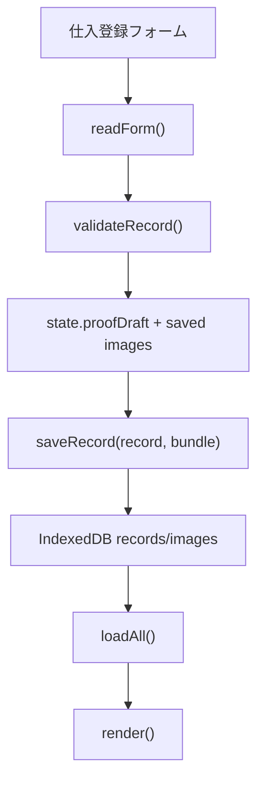
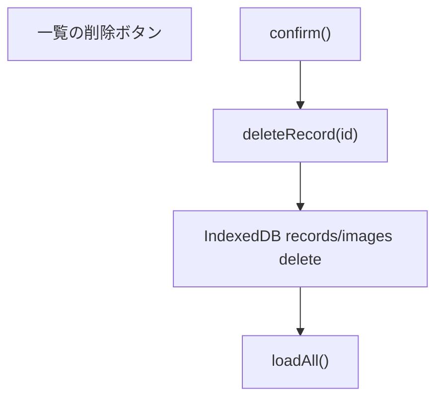

# Supabase仕入登録保存処理 設計書

## 目的

Version1完成に向けて、仕入登録データの保存先を現在のブラウザ内保存からSupabaseへ移行する。  
この設計書では、実装前に現行構造、Supabase保存先、移行方針、権限要件を整理する。

この段階では保存処理の実装には進まない。

## 1. 現在の保存構造

現在は `index.html` 内のJavaScriptでIndexedDBに保存している。

| 項目 | 内容 |
| --- | --- |
| DB名 | `shiire-refund-db` |
| DB version | `2` |
| 仕入レコードstore | `records` |
| 証憑画像store | `images` |
| 設定store | `settings` |
| マスタstore | `meta` |

### records

`records` は1件の仕入データを `id` keyPathで保存している。  
現在の主なデータ構造は以下。

| 現行キー | 内容 | 例 |
| --- | --- | --- |
| `id` | レコードID | `crypto.randomUUID()` |
| `date` | 仕入日 | `2026-07-03` |
| `channel` | チャネル名 | `ヤフオク` |
| `staff` | 担当名 | `未設定` |
| `name` | 商品名 | `Canon PowerShot` |
| `category` | 品目名 | `カメラ` |
| `qty` | 数量 | `1` |
| `branch` | 支店名 | `札幌` |
| `amount` | 税込金額 | `38000` |
| `kind` | 古物区分 | `kobutsu` / `jun` / `other` |
| `stock` | 棚卸資産 | `yes` / `no` |
| `qualified` | 適格事業者 | `yes` / `no` / `unknown` |
| `rate` | 税率 | `10` / `8` |
| `anon` | 取引形態 | `anon` / `named` |
| `seller` | 相手方氏名 | 任意 |
| `address` | 相手方住所 | 任意 |
| `memo` | メモ | 任意 |
| `hasImage` | 証憑画像あり | `true` / `false` |
| `updatedAt` | 最終更新日時 | ISO文字列 |

### images

`images` は仕入レコードID単位で証憑画像Bundleを保存している。

```js
{
  id: record.id,
  images: [
    {
      full: "data:image/jpeg;base64,...",
      thumb: "data:image/jpeg;base64,...",
      fileName: "receipt.jpg"
    }
  ]
}
```

現行仕様では1件の仕入レコードに複数画像を添付できる。  
代表サムネイルは `images[0]` を使う。

### settings

AI中継URL、同期URL、共有シークレットなどを保存している。  
Supabase保存処理のPhaseでは、まず仕入データ移行を対象にし、settingsのSupabase保存は対象外にする。

### meta

支店、チャネル、担当、品目の表示用マスタを保存している。  
Supabase側では `branches`, `channels`, `categories` を正とし、`staff` は当面 `profiles` または既存 `未設定` 表示で扱う。

## 2. Supabase側の保存先テーブル

仕入登録データは以下に保存する。

| 用途 | Supabase保存先 |
| --- | --- |
| 仕入本体 | `public.purchases` |
| 証憑画像メタデータ | `public.purchase_evidence` |
| 証憑画像本体 | Supabase Storage `evidence` bucket |
| 支店マスタ | `public.branches` |
| チャネルマスタ | `public.channels` |
| 品目マスタ | `public.categories` |
| 担当者/権限 | `public.profiles` |

### recordsからpurchasesへの対応

| 現行キー | Supabaseカラム | 備考 |
| --- | --- | --- |
| `id` | `id` | 既存UUIDを維持 |
| `date` | `purchase_date` | `date` |
| `branch` | `branch_id` | `branches.name` からID解決 |
| `channel` | `channel_id` | `channels.name` からID解決 |
| `category` | `category_id` | `categories.name` からID解決 |
| `staff` | `staff_id` | 初期は未設定なら `null` |
| `name` | `name` | そのまま |
| `qty` | `quantity` | 数値 |
| `amount` | `amount` | 数値 |
| `rate` | `tax_rate` | `8` / `10` |
| `kind` | `kind` | `kobutsu` / `jun` / `other` |
| `stock` | `stock` | `yes` / `no` |
| `qualified` | `qualified` | `yes` / `no` / `unknown` |
| `anon` | `transaction_type` | `anon` / `named` |
| `seller` | `seller_name` | 任意 |
| `address` | `seller_address` | 任意 |
| `memo` | `memo` | 任意 |
| `classified(record).kind` | `deduction_kind` | 保存時点の判定 |
| `classified(record).ratio` | `deduction_ratio` | 保存時点の割合 |
| `classified(record).tax` | `deduction_tax` | 保存時点の税額 |
| `classified(record).note` | `classification_note` | 保存時点の判定メモ |
| ログインユーザー | `created_by` / `updated_by` | `auth.uid()`相当 |

### imagesからpurchase_evidence / Storageへの対応

| 現行キー | Supabase保存先 | 備考 |
| --- | --- | --- |
| `record.id` | `purchase_evidence.purchase_id` | 仕入本体に紐付け |
| `image.full` | Storage `evidence` | data URLをBlob化してアップロード |
| `image.thumb` | 当面はフロント生成 | DB保存は不要。必要なら将来Storage保存 |
| `image.fileName` | `purchase_evidence.file_name` | 元ファイル名 |
| 配列index | `purchase_evidence.sort_order` | 表示順 |
| 自動生成path | `purchase_evidence.storage_path` | 例: `{purchase_id}/{sort_order}_{file_name}` |
| MIME | `purchase_evidence.mime_type` | data URLから推定 |
| サイズ | `purchase_evidence.file_size` | Blobサイズ |

## 3. 既存画面の保存フロー

現在の仕入登録フローは以下。



削除フローは以下。



編集フローは、一覧の編集ボタンから `setForm(record)` でフォームへ戻し、再度 `saveRecord()` で同じIDを上書きしている。

## 4. Supabase移行時の最小変更範囲

最小変更では、画面UIとCSV/Excel/PDF/税理士提出ZIPの既存ロジックを維持し、保存層だけを差し替える。

### 追加する責務

| 追加対象 | 内容 |
| --- | --- |
| Supabase repository層 | purchases / evidenceのCRUDをまとめる |
| mapper層 | 現行record形式とSupabase行形式を相互変換 |
| master resolver | `branch`, `channel`, `category` のname/id変換 |
| migration helper | IndexedDBからSupabaseへ初回同期 |

### 既存関数の扱い

| 既存関数 | 方針 |
| --- | --- |
| `loadAll()` | Supabase取得を優先し、失敗時はIndexedDBを読む |
| `saveRecord(record, imageBundle)` | IndexedDB保存を残しつつ、Supabase保存を追加 |
| `deleteRecord(id)` | 初期はSupabase論理削除 + IndexedDB削除 |
| `restoreBackup(file)` | まずIndexedDB復元を維持。Supabase反映は別操作にする |
| `exportBackup()` | 当面は `state.records` / `state.images` から出力を維持 |
| CSV/Excel/PDF/ZIP | `state.records` / `state.images` 依存のまま維持 |

### 最小変更の基本方針

1. 既存の `state.records` と `state.images` は引き続き画面の正規表示データにする。
2. Supabaseから取得したデータを現行record形式へ変換して `state.records` に入れる。
3. 保存時はIndexedDBへも保存し、ネットワーク失敗時の退避を残す。
4. Supabase接続・認証が未完了でも既存アプリが壊れないようにする。

## 5. 既存データを壊さない移行方針

### 基本方針

IndexedDBをすぐ削除しない。  
Supabase保存が安定するまで、IndexedDBはローカルバックアップとして残す。

### 移行手順

1. 起動時にSupabaseログイン状態を確認する。
2. `branches`, `channels`, `categories` をSupabaseから取得し、name/id mapを作る。
3. IndexedDBの `records` / `images` を読み込む。
4. Supabaseの `purchases` を取得する。
5. 既存IndexedDBにありSupabaseにないIDだけ、移行候補として扱う。
6. ユーザー操作で「Supabaseへ移行」を実行する。
7. 移行成功後もIndexedDBは削除しない。
8. すべての移行件数、成功件数、失敗件数を画面に表示する。

### 競合時の扱い

| 状況 | 方針 |
| --- | --- |
| Supabaseに同じIDがある | Supabaseを優先 |
| IndexedDBのほうが `updatedAt` 新しい | 確認メッセージを出し、初期実装では自動上書きしない |
| マスタ名がSupabaseにない | 保存を止め、マスタ不整合として表示 |
| 画像アップロード失敗 | 仕入本体は保存済み、画像のみ未移行として再試行可能にする |

### バックアップ

Supabase移行前に、既存のバックアップJSON出力を必ず案内する。  
移行実装時には「移行前バックアップ作成済み」チェックを設けるのが望ましい。

## 6. 保存・取得・更新・削除の実装順

保存処理は以下の順に進める。

### Step 1: 読み取り

目的: Supabaseからマスタと仕入一覧を取得して画面表示できる状態にする。

実装内容:

- `branches`, `channels`, `categories` を取得
- `purchases` を取得
- `purchase_evidence` を取得
- Supabase行を現行record形式へ変換
- `state.records` / `state.images` に反映

この段階では書き込みしない。

### Step 2: 新規保存

目的: フォームから新規仕入をSupabaseへ保存する。

順番:

1. `readForm()`
2. `validateRecord()`
3. name/id変換
4. `purchases` insert
5. 証憑画像があればStorageへupload
6. `purchase_evidence` insert
7. IndexedDBにも保存
8. `loadAll()`

### Step 3: 更新

目的: 既存仕入をSupabaseで更新する。

順番:

1. `purchases` update
2. 既存 `purchase_evidence` 一覧取得
3. 削除された画像のStorage削除またはメタデータ削除
4. 追加画像のStorage upload
5. `purchase_evidence` upsert/insert
6. IndexedDBにも保存
7. `loadAll()`

画像削除は初期実装ではメタデータ削除のみでもよいが、Storageごみを避けるため最終的にはStorage削除まで行う。

### Step 4: 削除

目的: 仕入を削除する。

初期実装は論理削除を推奨する。

順番:

1. `purchases.deleted_at = now()`
2. IndexedDBのrecords/imagesを削除
3. `state.records`から除外
4. Storage画像は即削除しない

理由:

- 税務・証憑用途では削除履歴が重要。
- 誤削除復旧余地を残せる。
- Storage画像の物理削除は管理者操作に限定しやすい。

### Step 5: IndexedDB移行

目的: 既存ローカルデータをSupabaseへ反映する。

順番:

1. 移行前バックアップJSONを作成
2. IndexedDB全件取得
3. Supabase既存ID取得
4. 未移行分だけinsert
5. 画像をStorageへupload
6. `purchase_evidence` insert
7. 移行結果を表示

## 7. RLSで必要になる権限

現行 `supabase/schema.sql` の基本方針は以下。

| テーブル | admin | staff | tax_accountant | anon |
| --- | --- | --- | --- | --- |
| `branches` | select | select | select | select |
| `channels` | select | select | select | select |
| `categories` | select | select | select | select |
| `purchases` | select/insert/update/delete | select/insert/update | select | 不可 |
| `purchase_evidence` | select/insert/update/delete | select/insert/update | select | 不可 |
| `monthly_packages` | select/insert/update/delete | select/insert | select | 不可 |

### 仕入保存に必要な権限

| 操作 | 必要権限 |
| --- | --- |
| 仕入一覧取得 | `purchases_select` |
| 仕入新規保存 | `purchases_insert_staff_admin` |
| 仕入更新 | `purchases_update_staff_admin` |
| 仕入削除 | 初期は `update` による論理削除。物理削除は `purchases_delete_admin` |
| 証憑メタデータ取得 | `purchase_evidence_select` |
| 証憑メタデータ追加 | `purchase_evidence_insert_staff_admin` |
| 証憑メタデータ更新 | `purchase_evidence_update_staff_admin` |
| 証憑メタデータ削除 | 初期は管理者のみ、または更新処理内で要検討 |
| Storage evidence取得 | `storage_evidence_select` |
| Storage evidence追加 | `storage_evidence_insert` |
| Storage evidence更新 | `storage_evidence_update` |
| Storage evidence削除 | `storage_evidence_delete` |

### 追加検討が必要なRLS

初期保存処理では、`staff` が自分の作成した仕入だけ更新できるように制限するか、社内3〜5人全員で共有編集できるようにするかを決める必要がある。

現行Policyは `staff` が `deleted_at is null` の仕入を更新できる。  
社内少人数運用ではまずこのままで開始し、運用テスト後に「作成者のみ更新」へ絞るか判断する。

## 8. 実装時の注意点

### 認証

Supabase保存処理は未ログイン状態では実行しない。  
未ログイン時はIndexedDB保存のみ継続し、「Supabase未ログイン」と表示する。

### ID互換

既存recordの `id` はUUID形式なので、Supabase `purchases.id` にそのまま使う。  
UUIDでない古いデータが存在した場合は、移行時に新UUIDを発行し、旧IDとの対応表を一時的に持つ。

### マスタ変換

現行recordは `branch`, `channel`, `category` をnameで持つ。  
Supabaseは `_id` 参照なので、保存前に以下のMapを作る。

- `branchNameToId`
- `channelNameToId`
- `categoryNameToId`

取得時は逆Mapで現行record形式に戻す。

### 控除判定

現行の `classify(record)` を継続利用する。  
保存時に `deduction_kind`, `deduction_ratio`, `deduction_tax`, `classification_note` へ保存して、月次提出時点の再現性を上げる。

### 証憑画像

現行の `full` はdata URL。  
Supabase Storageへ保存する際はdata URLをBlob化する。  
Storage pathは重複回避のため以下を推奨する。

```text
{purchase_id}/{sort_order}_{safe_file_name}
```

同名ファイルがある場合は `_{n}` を付ける。

## 9. 実装前チェックリスト

- [ ] Cloudflare PagesでSupabase環境変数が反映済み
- [ ] `branches`, `channels`, `categories` がanon/authenticatedでSELECT可能
- [ ] Supabase Authでadmin/staffユーザーが作成済み
- [ ] `profiles` に該当ユーザーが登録済み
- [ ] `purchases` のselect/insert/update RLSをstaff/adminで検証済み
- [ ] `purchase_evidence` のselect/insert/update RLSをstaff/adminで検証済み
- [ ] Storage `evidence` のupload/downloadをstaff/adminで検証済み
- [ ] 既存IndexedDBバックアップJSONを取得済み
- [ ] 保存失敗時にIndexedDBへ退避する方針をUIに表示できる

## 10. 次に実装すべき内容

保存処理実装の最初の一歩は、書き込みではなく読み取りから行う。

1. Supabaseログイン状態の確認表示を追加する。
2. `branches`, `channels`, `categories` をSupabaseから取得し、既存METAへ反映する。
3. `purchases` / `purchase_evidence` を読み取り、現行record形式へ変換する。
4. 画面表示がIndexedDB版と同じになることを確認する。
5. その後、新規保存へ進む。
